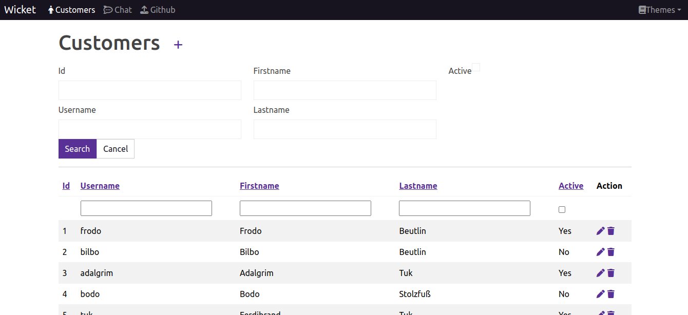

````shell
$ echo $JAVA_HOME
/usr/lib/jvm/java-17-openjdk-amd64

mvn spring-boot:run
````

http://127.0.0.1:8081/custsomers?6&theme=Cerulean

Преднастроенные темы:

Cerulean

Cyborg

Darkly

Flatly

Journal

Litera

Lumen

Lux

Materia

Minty

Pulse

Quartz

Sandstone

Simplex

Sketchy

Slate

Solar

Spacelab

Superhero

United

Vapor

Yeti


